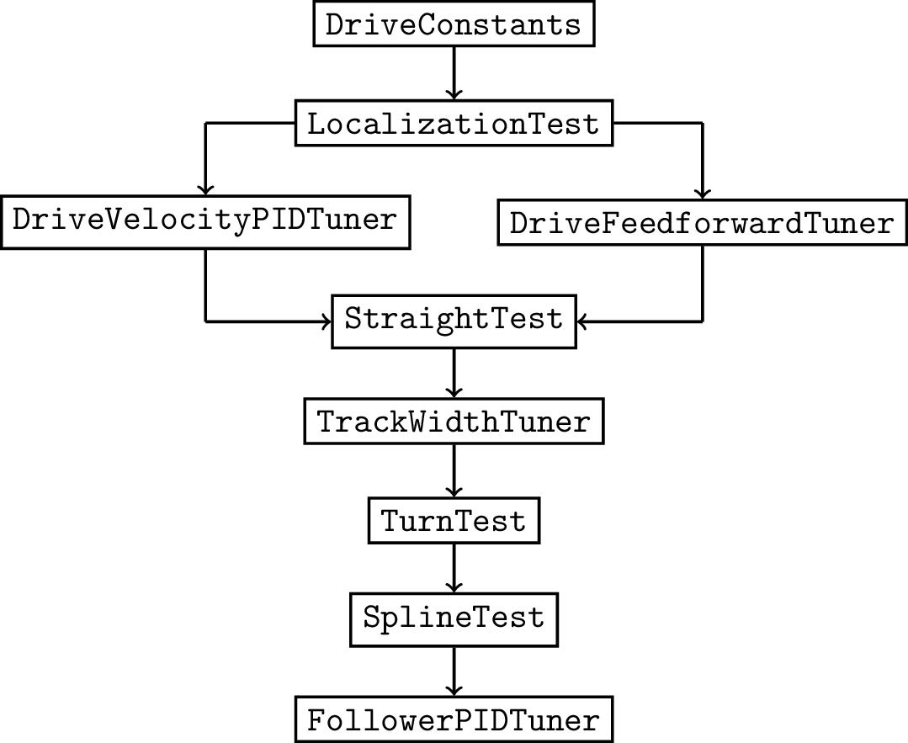

# Tuning

While actuators may share similar operating principles, their masses, friction, and other characteristics often vary significantly. It is impossible for Road Runner to come with this information at install, so the onus is on the user to determine certain mechanism parameters themselves. To aid in this process, the quickstart comes with several automated tuning routines that hopefully speed up the process. Many of the tuning tools also publish data to [FTC Dashboard](https://github.com/acmerobotics/ftc-dashboard) for debugging.


This procedure must be repeated anytime the robot physically change \(e.g., a heavy arm is added\). If pre-competition autonomous preparation is tight, consider practicing the tuning procedure a couple times beforehand to ensure things go smoothly.


## Drive

The subsections below should be followed in order. In general, mistakes/errors in earlier items may affect later items; if a problem is discovered in a previous step, it's best to repeat all of the steps after it. For this reason, it is imperative to check your progress at each step before moving on \(if possible\). Be as methodical and systematic as possible.

### Upgrade Firmware

If you're using REV Expansion Hubs, upgrade the firmware to version 1.8.2. It contains numerous improvements including better DC motor output linearity, closed-loop control, and I2C speeds. The firmware and instructions for flashing can be found [here](http://www.revrobotics.com/software/#ExpansionHubFirmware).

### Drive Class

Read through the entirety of `DriveConstants`. Some of the parameters can be filled in based on your physical robot. Others will be tuned or adjusted later on.

Select the appropriate built-in drive class from the `org.firstinspires.ftc.teamcode.drive` package and fill in all applicable items marked `// TODO` \(it may be helpful to delete the comments when you're completely done to keep track\). The optimized REV classes are recommended if your configuration is supported. The small latency improvements add up quickly and can significantly affect performance. 


Errors at this stage often manifest themselves as obvious errors in subsequent tests. For instance, the robot may report driving 30in but it drove 60in instead. Large or multiplicative discrepancies are almost always related to the drive constants.


### Drive Velocity PID

**Skip this step if not using the built-in velocity PID.**

It's recommended that you take advantage of the built-in motor velocity PID \(i.e., `RUN_USING_ENCODER`\) if you have encoders on your drive motors. If you decide to use the built-in PID, it's important to tune the coefficients for your robot \(this is especially true for drivetrains which often have higher loads than other actuators\). Run `DriveVelocityPIDTuner` and adjust the PID gains with the dashboard to minimize the error as best you can. Prioritize eliminating the phase lag even at the cost of some extra oscillations. Fill in `DriveConstants.MOTOR_VELO_PID` with the new coefficients when you're finished.

### Drive Characterization

**Skip this step if using the built-in velocity PID.**

To find `kV` and `kStatic`, the robot executes a quasi-static ramp test where the power is slowly ramped up to minimize acceleration \(it's effectively zero\). Throughout this procedure, the velocity and power are recorded. In the corresponding velocity vs. power graph, `kV` is the slope and `kStatic` is the y-intercept. Next, to find `kA`, the robot attempts to accelerate rapidly from rest. This time, the acceleration, velocity, and power are recorded. The velocity is used to determine the acceleration-only power. The acceleration is then graphed against this new power, and the resulting slope is `kA`.

This procedure is implemented in `DriveFeedforwardTuner`. The DS telemetry prompts will guide you through the process. If you want to do some analysis yourself, the tuner also saves the data to `/sdcard/RoadRunner` on the RC.

### Straight Test

To test the first few steps, run `StraightTest`. If the robot lands within a few inches of the target, these steps were successful. If not, repeat the procedures or consider the possibility of an incorrect drive constant (especially if using the built-in motor velocity PID). If this is still unsuccessful,you are free to adjust the parameters (i.e., `kV`, `kA`, and `kStatic` in `DriveConstants`) slightly to get closer to the goal \(keep in mind that feedback will be added later\).

### Drive Track Width

Although track width is a physical quantity, different rotation behavior may be observed due to scrub and other effects. To account for this, `TrackWidthTuner` computes the empirical track width by measuring the change in drive encoder positions for a given turn angle.

### Turn Test

To test this value, run `TurnTest`. If the robot is relatively close to the target, the value is good. Like the characterization, you can manually tweak the track width until sufficient accuracy is obtained \(keep in mind that feedback will be added later\).

### Spline Test

At this point, run `SplineTest`. If the robot successfully follows the spline, it's a good indication that the previous steps were successful. Otherwise, try to ascertain the cause of the failure. Did the robot over/under-rotate? If so, check the track width. Did the robot travel too far/stop too short? If so, check the drive characterization. This is where knowledge of Road Runner becomes extremely helpful.

### Follower PID

Once `SplineTest` works well, you can run `FollowerPIDTuner` and tune the follower PID controllers. Typically only a P controller is required \(on occasion a PD is justifiable\). This should get the last 10% tracking accuracy.

