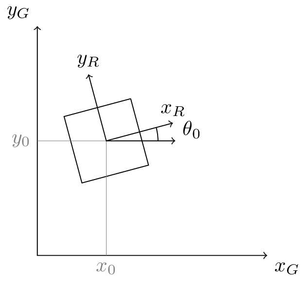
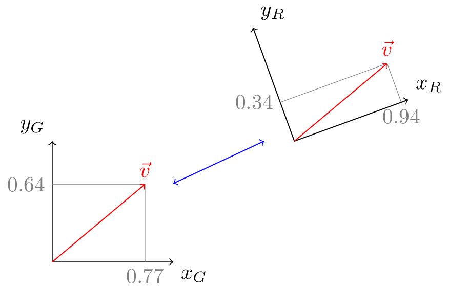
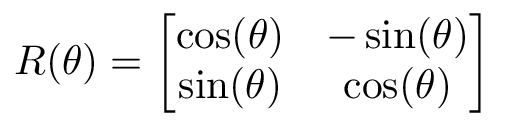

# Coordinate Frames

The previous discussion of motion profiling wraps up motion control for mechanisms with one degree of freedom. The remainder of the tour will be extending these ideas to 2D robot movement.

## Basics

In order to describe 2D motion, we need a consistent global coordinate frame. Within this global frame, the robot's position can be described using typical Cartesian $$(x,y)$$ coordinates. In addition to the linear position, the robot has a heading $$\theta$$ defined as the angle between the front of the robot and the global $$x$$ axis. The position and heading together constitute the robot's pose.

2D vectors and poses are built into the library and serve as primtiives for many other classes.



```java
Vector2d position = new Vector2d(x, y);
Pose2d pose = new Pose2d(position, theta);
```



```kotlin
val position = Vector2d(x, y)
val pose = Pose2d(position, theta)
```





In addition to the global coordinate frame, there is a robot coordinate frame that moves along with the robot. Paths are more conveniently described in the global frame while robot velocities are more conveniently described in the robot frame. To accommodate this, Road Runner constantly switches between frames.

## Transformations



Consider a velocity vector $$\vec{v}_G$$ in the global frame. To find the equivalent representation $$\vec{v}_G$$in the global frame, we will apply a rotation transformation. This transformation can be represented by the following matrix:


If you're not familiar with linear algebra, no worries. 3Blue1Brown has an awesome series on the [Essence of linear algebra](https://www.youtube.com/playlist?list=PLZHQObOWTQDPD3MizzM2xVFitgF8hE_ab). The first four videos are the most relevant to this section.




With this matrix, the transformation is simple: $$\vec{v}_G = R(\theta) \, \vec{v}_R$$. Since the inverse of $$R(\theta)$$ is just $$R(-\theta)$$, $$\vec{v}_R = R(-\theta) \, \vec{v}_G$$. Note the angular velocity $$\omega$$ remains the same between frames.

With `Vector2d`, rotations are simple:



```java
Vector2d v = new Vector2d(x, y);
Vecort2d w = v.rotated(rotAngleRad);
```



```kotlin
val v = Vector2d(x, y)
val w = v.rotated(rotAngleRad)
```



More sophisticated transformations can be found in `Kinematics`. For instance, the aforementioned pose-to-pose velocity transformation is `Kinematics.fieldToRobotVelocity()`.
