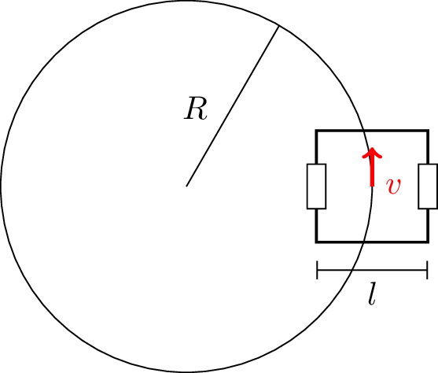
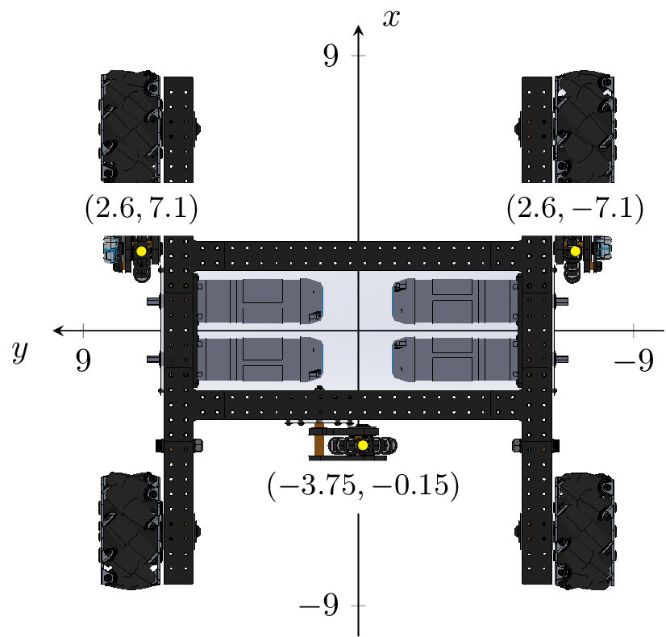

# Kinematics

## Inverse Kinematics

Tank drive kinematics are often overlooked in part due to their surface simplicity. Intuitively, for a tank drive, everyone knows that you provide the same voltage to both sides to go forward and opposite voltages to spin. Nevertheless, it's instructive to derive this formally and similar techniques can be applied to mecanum and swerve drives where intuition starts to fail.

Consider the following configuration of a tank robot traveling with constant forward and angular velocity. Throughout this discussion, we will assume that the drive has one wheel per side \(this is generally accurate although certain drivetrains may have significant scrub/friction\).



Here the forward velocity is $$v$$ and the angular velocity is $$\omega$$. The length $$l$$ in the picture is called the track width; it's defined as the distance between the wheels \(point of contact is assumed to be in the middle of the wheels\). First, the circumference of the circle is $$\Delta x = 2\pi R$$ which implies the robot takes time $$t = \frac{\Delta x}{v} = \frac{2\pi R}{v}$$ to complete a single revolution. Now, we can calculate the wheel velocities: $$v_l = 2\pi (R - l / 2) \cdot \frac{v}{2\pi R} = v - v \cdot \frac{l}{2R}$$ and $$v_r = 2\pi (R + l / 2) \cdot \frac{v}{2\pi R} = v + v \cdot \frac{l}{2R}$$. However, we still aren't quite done. In one revolution around the circle, the robot itself also completes one spin relative to the global frame. Thus $$\omega = 2\pi \cdot \frac{v}{2\pi R} = v / R$$. Substituting, we are left with $$v_l = v - \frac{l\omega}{2}$$ and $$v_r = v + \frac{l\omega}{2}$$.

Now we have all the ingredients for our trajectory feedforward. The trajectory itself gives the field-centric velocities of the robot. Applying a coordinate frame transform, these velocities are turned into robot-centric velocities. For a tank drive, the robot-centric velocities are $$v$$ and $$\omega$$. The equations derived in the previous paragraph turn $$v$$ and $$\omega$$ into the wheel velocities $$v_l$$ and $$v_r$$ which are sent to the motor controller.

## Forward Kinematics and Odometry

As it turns out, the same equations can be used to determine how the robot moved with wheel encoder data. Solving the system for $$v$$ and $$omega$$ gives (as you should verify) $$v = \frac{v_r + v_l}{2}$$ and $$\omega=\frac{v_r - v_l}{l}$$. To make the odometry computations tractable, we will split the robot motion into several time segments and assume constant velocity over each segment. The change in position over a given segment is just the velocity multiplied by time. The relationship between the position changes is $$\Delta x = \frac{\Delta x_r + \Delta x_l}{2}$$ and $$\Delta \theta = \frac{\Delta x_r - \Delta x_l}{l}$$. These position changes are accumulated over time with an initial pose to produce the current pose. In Road Runner, this process is performed incrementally with `Kinematics.relativeOdometryUpdate()`.

### Tracking Wheels

For better pose estimation, some robots have unactuated tracking wheels (sometimes called dead wheels) dedicated to odometry measurements. Three wheels are necessary to compute the full pose. These three wheels are commonly placed in the standard configuration shown below. 



Road Runner provides built-in localizers for tracking wheels. This configuration is implemented with the following code.



```java
public class StandardTrackingWheelLocalizer extends ThreeTrackingWheelLocalizer {
    public StandardTrackingWheelLocalizer() {
        super(Arrays.asList(
                new Pose2d(5.4, 14.2, 0.0), // left parallel
                new Pose2d(5.2, -14.2, 0.0), // right parallel
                new Pose2d(-7.5, -0.3, Math.toRadians(90)) // perpendicular
        ));
    }

    @NonNull
    @Override
    public List<Double> getWheelPositions() {
        // return list of encoder readings in inches
    }
}
```



```kotlin
class StandardTrackingWheelLocalizer : ThreeTrackingWheelLocalizer(listOf(
    Pose2d(5.4, 14.2, 0.0), // left parallel
    Pose2d(5.2, -14.2, 0.0), // right parallel
    Pose2d(-7.5, -0.3, Math.toRadians(90.0)) // perpendicular
)) {
    override fun getWheelPositions(): List<Double> {
        // return list of encoder readings in inches
    }
}
```



You can replace the default localizer of a `Drive` instance with `Drive#setLocalizer()`.
